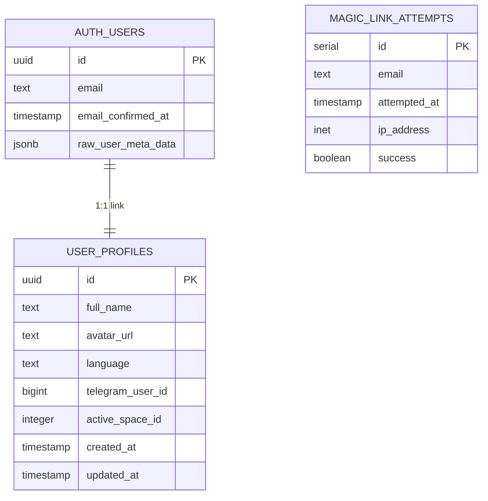

# Data Model: Shaliah Unified Onboarding & Authentication

**Feature**: 004-shaliah-onboarding-n  
**Date**: 2025-10-01  
**Purpose**: Define database schema, entities, relationships, and validation rules for authentication and user profiles.

---

## Entity Overview

This feature primarily interacts with **existing Supabase tables** (`auth.users`, `public.user_profiles`) and introduces one new **server-side tracking table** for rate limiting.

---

## 1. `auth.users` (Supabase Built-In)

**Ownership**: Managed by Supabase Auth (read-only for application).

| Field | Type | Constraints | Description |
|-------|------|-------------|-------------|
| `id` | UUID | PK, Not Null | Unique user identifier (Supabase-managed). |
| `email` | TEXT | Unique, Not Null | Verified email address. |
| `email_confirmed_at` | TIMESTAMP | Nullable | When email was verified (magic link or OAuth). |
| `created_at` | TIMESTAMP | Not Null | Account creation timestamp. |
| `last_sign_in_at` | TIMESTAMP | Nullable | Last successful authentication. |
| `raw_user_meta_data` | JSONB | Nullable | OAuth provider data (Google: `full_name`, `avatar_url`). |

**Notes**:
- Magic link authentication creates a user with `email` and `email_confirmed_at`.
- Google OAuth creates a user with `email`, `raw_user_meta_data.full_name`, `raw_user_meta_data.avatar_url`.

---

## 2. `public.user_profiles` (Existing, Extended)

**Ownership**: Application-managed (Shaliah API/client).

| Field | Type | Constraints | Description |
|-------|------|-------------|-------------|
| `id` | UUID | PK, FK → `auth.users.id` | 1:1 link to auth user. |
| `full_name` | TEXT | Nullable | User's display name. **Required for onboarding completion**. |
| `avatar_url` | TEXT | Nullable | URL to profile picture (Supabase Storage or external). |
| `language` | TEXT | Not Null, Default `'pt-BR'` | Preferred language (e.g., `'en-US'`, `'pt-BR'`). |
| `telegram_user_id` | BIGINT | Nullable, Unique | Telegram account linkage (future Ezer integration). |
| `active_space_id` | INTEGER | Nullable, FK → `spaces.id` | Current workspace (future feature). |
| `created_at` | TIMESTAMP | Not Null, Auto | Profile creation timestamp. |
| `updated_at` | TIMESTAMP | Not Null, Auto | Last profile update. |

**Relationships**:
- **1:1 with `auth.users`**: `user_profiles.id = auth.users.id`.
- **Trigger**: On `auth.users` INSERT, auto-create `user_profiles` row with inferred `language`.

**Validation Rules** (Application-Level):
- `full_name`: Min 2 chars, max 100 chars.
- `language`: Must be one of `['en-US', 'pt-BR', 'es', 'fr', 'de', 'uk', 'ru']` (constitution-mandated languages).
- `avatar_url`: Valid URL format; optional.

**State Transitions**:
1. **New user (magic link)**: `full_name = NULL` → Onboarding required.
2. **New user (Google)**: `full_name` pre-filled from OAuth → Onboarding skipped.
3. **Profile complete**: `full_name != NULL` → Direct to dashboard.

---

## 3. `public.magic_link_attempts` (New)

**Ownership**: Application-managed (Yesod API).

**Purpose**: Server-side rate limiting for magic link sends (10 per email per rolling hour).

| Field | Type | Constraints | Description |
|-------|------|-------------|-------------|
| `id` | SERIAL | PK | Auto-increment ID. |
| `email` | TEXT | Not Null, Indexed | Email address requesting magic link. |
| `attempted_at` | TIMESTAMP | Not Null, Default `NOW()` | Timestamp of send attempt. |
| `ip_address` | INET | Nullable | Requester IP (optional, for abuse detection). **Privacy**: IP addresses retained for 24 hours max, then nullified or row deleted per GDPR compliance. |
| `success` | BOOLEAN | Not Null, Default `TRUE` | Whether send succeeded (vs rate-limited). |

**Indexes**:
- `idx_magic_link_attempts_email_timestamp` ON `(email, attempted_at DESC)` — for rolling window queries.

**Cleanup Policy**:
- **TTL**: Delete rows older than 1 hour (automated via cron or pg_cron).
- **Rationale**: Only need recent history for rate limit calculation.

**Query Pattern** (Rate Limit Check):
```sql
SELECT COUNT(*)
FROM public.magic_link_attempts
WHERE email = $1
  AND attempted_at > NOW() - INTERVAL '1 hour'
  AND success = TRUE;
```
- If `COUNT >= 10` → Reject with `429 Too Many Requests`.

---

## 4. Session State (Supabase-Managed)

**Storage**: Supabase Auth session cookies + JWT tokens (not in DB).

**Lifecycle**:
- **Creation**: On successful magic link click or OAuth callback.
- **Refresh**: Supabase SDK auto-refreshes access token using refresh token.
- **Expiry**:
  - **Absolute**: 30 days from creation.
  - **Idle**: 7 days of inactivity (no refresh).
- **Logout**: App-local (`supabase.auth.signOut()` clears session in current app only).

**No DB table required** — session managed by Supabase infrastructure.

---

## Entity Relationship Diagram (Mermaid)



---

## Migration Strategy

### Required Migrations

1. **Create `magic_link_attempts` table**:
   ```sql
   CREATE TABLE public.magic_link_attempts (
     id SERIAL PRIMARY KEY,
     email TEXT NOT NULL,
     attempted_at TIMESTAMP NOT NULL DEFAULT NOW(),
     ip_address INET,
     success BOOLEAN NOT NULL DEFAULT TRUE
   );
   
   CREATE INDEX idx_magic_link_attempts_email_timestamp
   ON public.magic_link_attempts (email, attempted_at DESC);
   ```

2. **Update `user_profiles` trigger** (if not exists):
   Ensure auto-creation on `auth.users` INSERT with inferred `language` (from `Accept-Language` header or default `'pt-BR'`).
   
   ```sql
   CREATE OR REPLACE FUNCTION public.handle_new_user()
   RETURNS TRIGGER AS $$
   BEGIN
     INSERT INTO public.user_profiles (id, language)
     VALUES (
       NEW.id,
       COALESCE(NEW.raw_app_meta_data->>'inferred_language', 'pt-BR')
     );
     RETURN NEW;
   END;
   $$ LANGUAGE plpgsql SECURITY DEFINER;
   
   CREATE TRIGGER on_auth_user_created
     AFTER INSERT ON auth.users
     FOR EACH ROW EXECUTE FUNCTION public.handle_new_user();
   ```

3. **Row-Level Security (RLS) Policies**:
   - `user_profiles`:
     - SELECT: Users can read their own profile (`auth.uid() = id`).
     - UPDATE: Users can update their own profile (`auth.uid() = id`).
   - `magic_link_attempts`:
     - No RLS (server-side only; not exposed to client).

---

## Validation Summary

| Entity | Field | Validation | Enforced By |
|--------|-------|------------|-------------|
| `user_profiles` | `full_name` | 2-100 chars | App (Zod schema) |
| `user_profiles` | `language` | Enum: `en-US`, `pt-BR`, `es`, `fr`, `de`, `uk`, `ru` | App + DB check constraint |
| `user_profiles` | `avatar_url` | Valid URL | App (Zod schema) |
| `magic_link_attempts` | `email` | Valid email format | App (Supabase validation) |
| `magic_link_attempts` | Rolling window | ≤10 per hour | App (query check) |

---

**Phase 1 Data Model Complete**: Schema defined, migrations planned, validation rules documented. Ready for contract generation.
