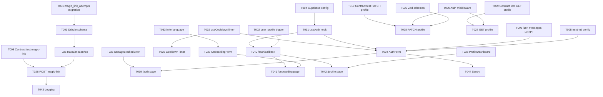

# Tasks: Shaliah Unified Onboarding & Authentication

**Branch**: `004-shaliah-onboarding-n`  
**Input**: Design documents from `/home/patrickkmatias/repos/yesod-ecosystem/specs/004-shaliah-onboarding-n/`  
**Prerequisites**: plan.md ✓, research.md ✓, data-model.md ✓, contracts/ ✓, quickstart.md ✓

## Execution Flow (main)
```
1. Load plan.md from feature directory ✓
   → Tech stack: TypeScript 5.x, Next.js 14+, Supabase, next-intl, shadcn/ui
   → Structure: Web project (apps/shaliah-next + apps/yesod-api)
2. Load optional design documents ✓
   → data-model.md: 3 entities (auth.users, user_profiles, magic_link_attempts)
   → contracts/: 3 endpoints (magic-link-request, user-profile-get, user-profile-update)
   → research.md: 10 technical decisions
   → quickstart.md: 10 acceptance scenarios
3. Generate tasks by category ✓
4. Apply task rules ✓
5. Number tasks sequentially (T001-T042) ✓
6. Generate dependency graph ✓
7. Create parallel execution examples ✓
8. Validate task completeness ✓
```

## Format: `[ID] [P?] Description`
- **[P]**: Can run in parallel (different files, no dependencies)
- Include exact file paths in descriptions

## Path Conventions
- **Frontend**: `apps/shaliah-next/src/`
- **Backend API**: `apps/yesod-api/src/`
- **Frontend Tests**: `apps/shaliah-next/__tests__/` (Jest + React Testing Library)
- **Backend Tests**: `apps/yesod-api/__tests__/` (Vitest)
- **Shared Logger**: `packages/logger/`
- **i18n Messages**: `apps/shaliah-next/messages/`

---

## Phase 3.1: Setup & Infrastructure

### Database & Migrations
- [ ] **T001** [P] Create migration: `magic_link_attempts` table  
  **Path**: `apps/yesod-api/drizzle/0005_create_magic_link_attempts.sql`  
  **Description**: Create table with fields: id (serial), email (text), attempted_at (timestamp), ip_address (inet), success (boolean). Add index on (email, attempted_at DESC).  
  **Reference**: data-model.md § 3

- [ ] **T002** [P] Create migration: Update `handle_new_user()` trigger  
  **Path**: `apps/yesod-api/drizzle/0002_update_user_profile_trigger.sql` (rename from 0006 to preserve order)  
  **Description**: DROP TRIGGER IF EXISTS on_auth_user_created; DROP FUNCTION IF EXISTS handle_new_user(); then recreate function to infer language from `raw_app_meta_data->>'inferred_language'` or default to 'pt-BR'. Recreate trigger for auto-creation of user_profiles on auth.users INSERT.  
  **Reference**: data-model.md § 2

- [ ] **T003** [P] Add Drizzle schema for `magic_link_attempts`  
  **Path**: `apps/yesod-api/src/db/schema/magic-link-attempts.ts`  
  **Description**: Define Drizzle schema matching migration. Export table definition.  
  **Reference**: data-model.md § 3

### Configuration & Environment
- [ ] **T004** [P] Configure Supabase Auth settings (Programmatic)  
  **Path**: Execute from repo root + document in `docs/shaliah-auth-config.md`  
  **Description**: Use Supabase CLI or SQL to configure: Enable magic link (15min expiry), configure Google OAuth provider, set JWT expiry (access token 1h, refresh token 7d idle + 30d absolute). Commands:
  ```bash
  # Update auth config via SQL (run in Supabase SQL editor or CLI)
  UPDATE auth.config SET 
    enable_signup = true,
    external_email_enabled = true,
    mailer_autoconfirm = false,
    email_link_expiry_time = 900; -- 15 minutes
  
  # Google OAuth: Configure via Supabase Dashboard > Authentication > Providers > Google
  # (Cannot be done via CLI yet - document client ID, secret, redirect URI)
  # Redirect URI: https://[project-ref].supabase.co/auth/v1/callback
  
  # JWT settings: Dashboard > Settings > API > JWT Settings
  # Access token: 3600s (1h), Refresh token: 604800s (7d)
  ```
  Document manual OAuth setup steps. Automate where possible.  
  **Reference**: research.md § 1, § 6

- [ ] **T005** [P] Set up next-intl configuration  
  **Path**: `apps/shaliah-next/src/i18n/request.ts` + `apps/shaliah-next/src/middleware.ts`  
  **Description**: Configure next-intl middleware to detect locale from Accept-Language header. Set default to 'pt-BR'. Create locale cookie management.  
  **Reference**: research.md § 3, § 9

- [ ] **T006** [P] Create i18n message files (EN + PT-BR)  
  **Paths**: `apps/shaliah-next/messages/en.json`, `apps/shaliah-next/messages/pt-BR.json`  
  **Description**: **BOTH files must be created.** Define message keys for auth flow, onboarding, profile dashboard. Include: `auth.continueWith`, `auth.continueWithEmail`, `auth.continueWithGoogle`, `auth.magicLinkSent`, `auth.cooldownTimer`, `auth.cooldownMessage`, `auth.linkExpired`, `auth.linkInvalid`, `auth.linkUsed`, `onboarding.enterFullName`, `profile.changeLanguage`, error messages. EN and PT-BR must have identical key structures (values translated).  
  **Reference**: research.md § 9

- [ ] **T007** [P] Initialize Sentry for shaliah-next  
  **Path**: `apps/shaliah-next/instrumentation.ts` (or `sentry.client.config.ts` + `sentry.server.config.ts`)  
  **Description**: Configure @sentry/nextjs with DSN. Set up error boundary and performance monitoring.  
  **Reference**: Constitution § Observability

---

## Phase 3.2: Tests First (TDD) ⚠️ MUST COMPLETE BEFORE 3.3

**CRITICAL: These tests MUST be written and MUST FAIL before ANY implementation**

### Contract Tests (Backend API)
- [ ] **T008** [P] Contract test: POST /api/auth/magic-link/request  
  **Path**: `apps/yesod-api/__tests__/contract/magic-link-request.test.ts`  
  **Description**: Test success (200), cooldown (429), hourly limit (429), invalid email (400). Assert response schemas match contract. Use Vitest + supertest.  
  **Reference**: contracts/magic-link-request.md

- [ ] **T009** [P] Contract test: GET /api/user/profile  
  **Path**: `apps/yesod-api/__tests__/contract/user-profile-get.test.ts`  
  **Description**: Test authenticated success (200), unauthorized (401), profile fields. Mock Supabase auth. Use Vitest + supertest.  
  **Reference**: contracts/user-profile-get.md

- [ ] **T010** [P] Contract test: PATCH /api/user/profile  
  **Path**: `apps/yesod-api/__tests__/contract/user-profile-update.test.ts`  
  **Description**: Test full_name update (200), language update (200), validation errors (400), unauthorized (401). Assert profile returned. Use Vitest + supertest.  
  **Reference**: contracts/user-profile-update.md

### Component Tests (Frontend UI)
- [ ] **T011** [P] Component test: AuthForm (email + Google)  
  **Path**: `apps/shaliah-next/__tests__/components/AuthForm.test.tsx`  
  **Description**: Test rendering of "Continue with Email" and "Continue with Google" buttons, email input validation, form submission. Use Jest + RTL.  
  **Reference**: spec.md FR-001

- [ ] **T012** [P] Component test: CooldownTimer  
  **Path**: `apps/shaliah-next/__tests__/components/CooldownTimer.test.tsx`  
  **Description**: Test countdown display (60s → 0s), button disabled during cooldown, button enabled at 0s. Mock timers. Use Jest + RTL.  
  **Reference**: spec.md FR-004

- [ ] **T013** [P] Component test: OnboardingForm  
  **Path**: `apps/shaliah-next/__tests__/components/OnboardingForm.test.tsx`  
  **Description**: Test full_name input (required), avatar upload (optional), language dropdown (pre-filled), form submission. Use Jest + RTL.  
  **Reference**: spec.md FR-010, FR-010a

- [ ] **T014** [P] Component test: ProfileDashboard  
  **Path**: `apps/shaliah-next/__tests__/components/ProfileDashboard.test.tsx`  
  **Description**: Test display of user info (name, avatar, language), language change dropdown, save action. Use Jest + RTL.  
  **Reference**: spec.md FR-011

- [ ] **T015** [P] Component test: StorageBlockedError  
  **Path**: `apps/shaliah-next/__tests__/components/StorageBlockedError.test.tsx`  
  **Description**: Test non-dismissible overlay rendering, instructions text, retry button. Use Jest + RTL.  
  **Reference**: spec.md FR-013

### Integration Tests (End-to-End Scenarios)
- [ ] **T016** [P] Integration test: Magic link happy path (Scenario 1)  
  **Path**: `apps/shaliah-next/__tests__/integration/auth-magic-link.test.tsx`  
  **Description**: Test full flow: request magic link → UI state (email shown, cooldown timer) → mock link click → auth success → redirect logic (onboarding vs dashboard). Use Jest + RTL + MSW.  
  **Reference**: quickstart.md Scenario 1

- [ ] **T017** [P] Integration test: Cooldown enforcement (Scenario 2)  
  **Path**: `apps/shaliah-next/__tests__/integration/auth-cooldown.test.tsx`  
  **Description**: Test cooldown timer countdown, resend button disabled/enabled cycle. Use Jest + RTL + mock timers.  
  **Reference**: quickstart.md Scenario 2

- [ ] **T018** [P] Integration test: Rate limit (Scenario 3)  
  **Path**: `apps/yesod-api/__tests__/integration/rate-limit.test.ts`  
  **Description**: Test 10 sends succeed, 11th fails with 429. Verify different email bypasses limit. Use Vitest + supertest.  
  **Reference**: quickstart.md Scenario 3

- [ ] **T019** [P] Integration test: Google OAuth signup (Scenario 4)  
  **Path**: `apps/shaliah-next/__tests__/integration/auth-google-signup.test.tsx`  
  **Description**: Test Google OAuth flow (mock), account creation, profile pre-fill, onboarding skip. Use Jest + RTL + MSW.  
  **Reference**: quickstart.md Scenario 4

- [ ] **T020** [P] Integration test: Google OAuth account linking (Scenario 5)  
  **Path**: `apps/shaliah-next/__tests__/integration/auth-google-linking.test.tsx`  
  **Description**: Test existing magic-link account + Google OAuth with same email → no duplicate, identity linked. Use Jest + RTL + MSW.  
  **Reference**: quickstart.md Scenario 5

- [ ] **T020a** [P] Integration test: Different Google email creates distinct account (FR-008)  
  **Path**: `apps/shaliah-next/__tests__/integration/auth-google-separate-account.test.tsx`  
  **Description**: Test existing account for emailA@example.com. Authenticate via Google with emailB@example.com → new account created (distinct user_profiles row), no linking. Assert two separate accounts exist. Use Jest + RTL + MSW.  
  **Reference**: spec.md FR-008

- [ ] **T021** [P] Integration test: Conditional onboarding (Scenario 7)  
  **Path**: `apps/shaliah-next/__tests__/integration/onboarding-conditional.test.tsx`  
  **Description**: Test onboarding shown when full_name missing, skipped when present. Use Jest + RTL.  
  **Reference**: quickstart.md Scenario 7

- [ ] **T022** [P] Integration test: Language change (Scenario 7)  
  **Path**: `apps/shaliah-next/__tests__/integration/profile-language-change.test.tsx`  
  **Description**: Test language dropdown change, profile update, locale cookie set, UI re-renders in new language. Use Jest + RTL.  
  **Reference**: quickstart.md Scenario 7

- [ ] **T023** [P] Integration test: Session expiry (Scenario 10)  
  **Path**: `apps/shaliah-next/__tests__/integration/session-expiry.test.tsx`  
  **Description**: Test expired session detection (mock Date >30d or idle >7d), redirect to `/auth` page with `?expired=true` query param. Assert error message shown. Use Jest + RTL.  
  **Acceptance Criteria**: 1) Session expires after 30d absolute or 7d idle (mocked). 2) User redirected to `/auth?expired=true`. 3) Expired session error message displayed to user.  
  **Reference**: quickstart.md Scenario 10

- [ ] **T024** [P] Integration test: Storage blocked error (Scenario 9)  
  **Path**: `apps/shaliah-next/__tests__/integration/storage-blocked.test.tsx`  
  **Description**: Test localStorage.setItem() failure → error overlay shown. Use Jest + RTL.  
  **Reference**: quickstart.md Scenario 9

---

## Phase 3.3: Core Implementation (ONLY after tests are failing)

### Backend: Rate Limiting Service
- [ ] **T025** [P] Create `RateLimitService` for magic links  
  **Path**: `apps/yesod-api/src/services/rate-limit-service.ts`  
  **Description**: Implement checkCooldown(email) → returns seconds remaining. Implement checkHourlyLimit(email) → returns boolean + retry_after. Query magic_link_attempts table. Log via packages/logger.  
  **Reference**: research.md § 2, data-model.md § 3

### Backend: API Endpoints
- [ ] **T026** POST /api/auth/magic-link/request endpoint  
  **Path**: `apps/yesod-api/src/routes/auth/magic-link-request.ts`  
  **Description**: Implement handler: validate email, check rate limits (cooldown + hourly), call `supabase.auth.signInWithOtp()`, insert attempt row, return 200 or 429. Wire to Hono router.  
  **Reference**: contracts/magic-link-request.md  
  **Depends on**: T025

- [ ] **T027** GET /api/user/profile endpoint  
  **Path**: `apps/yesod-api/src/routes/user/profile-get.ts`  
  **Description**: Implement handler: extract user ID from auth middleware, query user_profiles, return 200 with profile or 401/404. Wire to Hono router.  
  **Reference**: contracts/user-profile-get.md

- [ ] **T028** PATCH /api/user/profile endpoint  
  **Path**: `apps/yesod-api/src/routes/user/profile-update.ts`  
  **Description**: Implement handler: validate input (Zod schema), update user_profiles, set locale cookie if language changed, return 200 with updated profile or 400/401. Wire to Hono router.  
  **Reference**: contracts/user-profile-update.md

### Backend: Middleware & Validation
- [ ] **T029** [P] Create input validation schemas (Zod)  
  **Path**: `apps/yesod-api/src/validation/user-profile.schema.ts`  
  **Description**: Define Zod schemas for profile update (full_name 2-100 chars, avatar_url URL, language enum). Export validation functions.  
  **Reference**: data-model.md § 2

- [ ] **T030** Auth middleware for protected routes  
  **Path**: `apps/yesod-api/src/middleware/auth.ts`  
  **Description**: Implement Hono middleware to verify Supabase JWT, extract user ID, attach to context. Return 401 if invalid/missing.  
  **Reference**: research.md § 1

### Frontend: Shared Hooks & Utils
- [ ] **T031** [P] Create `useAuth` hook  
  **Path**: `apps/shaliah-next/src/hooks/useAuth.ts`  
  **Description**: Wrap Supabase auth methods (signInWithOtp, signInWithOAuth, signOut, getUser). Manage auth state. Detect storage blocked errors.  
  **Reference**: research.md § 1, § 8

- [ ] **T032** [P] Create `useCooldownTimer` hook  
  **Path**: `apps/shaliah-next/src/hooks/useCooldownTimer.ts`  
  **Description**: Manage cooldown state (localStorage persistence), countdown timer (useEffect + setInterval), return { secondsRemaining, canResend }.  
  **Reference**: research.md § 2

- [ ] **T033** [P] Create language inference utility  
  **Path**: `apps/shaliah-next/src/lib/infer-language.ts`  
  **Description**: Read Accept-Language header (server-side), parse top preference, fallback to 'pt-BR'. Export inferLanguage(headers) function.  
  **Reference**: research.md § 3

### Frontend: Auth Components
- [ ] **T034** Build `AuthForm` component  
  **Path**: `apps/shaliah-next/src/components/AuthForm.tsx`  
  **Description**: Render "Continue with Email" and "Continue with Google" buttons (shadcn/ui Button). Email flow: show input → send magic link → transition to confirmation state with email, cooldown timer, back button. Use useAuth hook. i18n with next-intl.  
  **Reference**: spec.md FR-001, FR-005  
  **Depends on**: T031, T032

- [ ] **T035** [P] Build `CooldownTimer` component  
  **Path**: `apps/shaliah-next/src/components/CooldownTimer.tsx`  
  **Description**: Display countdown (MM:SS format), disable resend button until 0s. Use useCooldownTimer hook. i18n for labels.  
  **Reference**: spec.md FR-004  
  **Depends on**: T032

- [ ] **T036** [P] Build `StorageBlockedError` component  
  **Path**: `apps/shaliah-next/src/components/StorageBlockedError.tsx`  
  **Description**: Non-dismissible full-screen overlay (Dialog from shadcn/ui). Show error message + instructions. Retry button re-checks storage. i18n.  
  **Reference**: spec.md FR-013

### Frontend: Onboarding & Profile Components
- [ ] **T037** Build `OnboardingForm` component  
  **Path**: `apps/shaliah-next/src/components/OnboardingForm.tsx`  
  **Description**: Form with full_name input (required), avatar upload (optional, Supabase Storage), language dropdown (pre-filled). Submit → PATCH /api/user/profile → redirect to dashboard. Use shadcn/ui Form, Input, Select. i18n.  
  **Reference**: spec.md FR-010, FR-010a  
  **Depends on**: T031, T033

- [ ] **T038** Build `ProfileDashboard` component  
  **Path**: `apps/shaliah-next/src/components/ProfileDashboard.tsx`  
  **Description**: Display user info (name, avatar with placeholder, language). Language change dropdown → PATCH /api/user/profile → update locale cookie. Logout button (app-local). Use shadcn/ui. i18n.  
  **Reference**: spec.md FR-011, FR-012  
  **Depends on**: T031

### Frontend: Page Routes & Auth Callbacks
- [ ] **T039** Create `/auth` page  
  **Path**: `apps/shaliah-next/src/app/auth/page.tsx`  
  **Description**: Render AuthForm component. Detect storage blocked → show StorageBlockedError. Server-side: infer language, set locale cookie.  
  **Depends on**: T034, T036

- [ ] **T039a** Handle magic link errors in `/auth/callback`  
  **Path**: `apps/shaliah-next/src/app/auth/callback/page.tsx` (extends T040)  
  **Description**: Catch and handle magic link errors: expired link, reused link, invalid token. Show user-friendly error page with "Request new link" button (respects cooldown). Use next-intl for error messages (`auth.linkExpired`, `auth.linkInvalid`, `auth.linkUsed`). Display retry-after countdown if within cooldown.  
  **Reference**: spec.md FR-014  
  **Depends on**: T040

- [ ] **T040** Create `/auth/callback` page  
  **Path**: `apps/shaliah-next/src/app/auth/callback/page.tsx`  
  **Description**: Handle Supabase auth callback (magic link click, OAuth redirect). Exchange code for session. Fetch user_profiles. Redirect logic: if full_name NULL → /onboarding, else → /profile. Error handling for expired/reused links (see T039a).  
  **Reference**: research.md § 4  
  **Depends on**: T031

- [ ] **T041** Create `/onboarding` page  
  **Path**: `apps/shaliah-next/src/app/onboarding/page.tsx`  
  **Description**: Protected route (require auth). Render OnboardingForm component. On submit success → redirect to /profile.  
  **Depends on**: T037, T040

- [ ] **T042** Create `/profile` page  
  **Path**: `apps/shaliah-next/src/app/profile/page.tsx`  
  **Description**: Protected route (require auth). Render ProfileDashboard component. Fetch user profile on mount (GET /api/user/profile).  
  **Depends on**: T038, T040

---

## Phase 3.4: Integration & Observability

- [ ] **T043** Wire structured logging for auth events  
  **Path**: `apps/yesod-api/src/routes/auth/magic-link-request.ts` (update T026)  
  **Description**: Log events using packages/logger: `auth.magic_link.sent`, `auth.magic_link.rate_limited`, `auth.magic_link.consumed`. Include email (hashed?), timestamp, IP.  
  **Reference**: spec.md FR-015, research.md § 10

- [ ] **T044** Wire Sentry error tracking in auth flow  
  **Path**: `apps/shaliah-next/src/components/AuthForm.tsx` (update T034)  
  **Description**: Capture auth errors to Sentry (magic link send failure, OAuth errors). Add user context.  
  **Reference**: Constitution § Observability

- [ ] **T045** Add RLS policies for `user_profiles`  
  **Path**: Supabase Dashboard (manual) + document in `docs/shaliah-auth-config.md`  
  **Description**: Enable RLS on user_profiles. Policy: SELECT/UPDATE where `auth.uid() = id`. Test with different users.  
  **Reference**: data-model.md § 2

- [ ] **T046** Test cross-app session behavior  
  **Path**: Manual test (document in `docs/cross-app-session-test.md`)  
  **Description**: Deploy to staging. Verify session shared across shaliah-next tabs. Verify logout is app-local (future: test with Ezer web UI).  
  **Reference**: research.md § 5

---

## Phase 3.5: i18n & Polish

### i18n Expansion
- [ ] **T047** [P] Add Spanish (es) translations  
  **Path**: `apps/shaliah-next/messages/es.json`  
  **Description**: Copy EN keys, translate to Spanish. Verify with language switcher.  
  **Reference**: Constitution Principle IX

- [ ] **T048** [P] Add French (fr) translations  
  **Path**: `apps/shaliah-next/messages/fr.json`  
  **Description**: Copy EN keys, translate to French.

- [ ] **T049** [P] Add German (de) translations  
  **Path**: `apps/shaliah-next/messages/de.json`  
  **Description**: Copy EN keys, translate to German.

- [ ] **T050** [P] Add Ukrainian (uk) translations  
  **Path**: `apps/shaliah-next/messages/uk.json`  
  **Description**: Copy EN keys, translate to Ukrainian.

- [ ] **T051** [P] Add Russian (ru) translations  
  **Path**: `apps/shaliah-next/messages/ru.json`  
  **Description**: Copy EN keys, translate to Russian.

### Unit Tests & Performance
- [ ] **T052** [P] Unit test: RateLimitService  
  **Path**: `apps/yesod-api/__tests__/unit/rate-limit-service.test.ts`  
  **Description**: Test cooldown calculation, hourly limit logic, edge cases (expired rows, timezone). Use Vitest.

- [ ] **T053** [P] Unit test: Input validation schemas  
  **Path**: `apps/yesod-api/__tests__/unit/validation.test.ts`  
  **Description**: Test Zod schemas for user profile (valid/invalid full_name, avatar_url, language). Use Vitest.

- [ ] **T054** Performance test: Auth UI load time  
  **Path**: Manual test (document in `docs/performance-baseline.md`)  
  **Description**: Measure auth page load time on 3G Fast (Chrome DevTools throttling). Target: <2s. Optimize if needed.  
  **Reference**: spec.md NFR-004

- [ ] **T055** Performance test: Magic link send latency  
  **Path**: Manual test (document in `docs/performance-baseline.md`)  
  **Description**: Measure POST /api/auth/magic-link/request latency. Target: <200ms. Profile if needed.

### Accessibility & Documentation
- [ ] **T056** Accessibility audit: Keyboard navigation  
  **Path**: Manual test (document in `docs/accessibility-audit.md`)  
  **Description**: Test all auth, onboarding, profile flows with keyboard only. Verify focus indicators, tab order, ARIA labels. Fix issues.  
  **Reference**: spec.md NFR-002

- [ ] **T057** Accessibility audit: Screen reader  
  **Path**: Manual test (document in `docs/accessibility-audit.md`)  
  **Description**: Test with NVDA/JAWS. Verify form labels, error messages, button descriptions. Fix issues.

- [ ] **T058** Update API documentation  
  **Path**: `docs/yesod-api.md`  
  **Description**: Document 3 new endpoints (magic-link request, profile get/update). Include request/response examples, error codes.

- [ ] **T059** Final quickstart validation  
  **Path**: Execute `specs/004-shaliah-onboarding-n/quickstart.md` scenarios  
  **Description**: Run all 10 manual test scenarios. Check off validation checklist. Document any issues.

- [ ] **T059a** [P] Audit i18n message keys for FR-016 compliance  
  **Path**: `apps/shaliah-next/messages/en.json`, `apps/shaliah-next/messages/pt-BR.json`  
  **Description**: Search for legacy keys: "sign in", "sign up", "login", "register", "signin", "signup". Replace with "Continue with" language per FR-016. Update AuthForm component to use new keys. Ensure consistency across EN and PT-BR.  
  **Reference**: spec.md FR-016  
  **Depends on**: T006

- [ ] **T059b** [P] Document avatar storage specifications  
  **Path**: `docs/avatar-storage-spec.md` or inline in T037  
  **Description**: Document Supabase Storage configuration for avatars: Bucket name `user-avatars`, path `/public/{user_id}/avatar.{ext}`, max file size 5MB, allowed types (image/jpeg, image/png, image/webp). RLS policies: public read (`SELECT`), user-writable (`INSERT`, `UPDATE` where `auth.uid() = user_id`). Default placeholder: shadcn/ui Avatar component with user initials (first 2 chars of full_name) on hashed color background.  
  **Reference**: Analysis M2, M4

---

## Dependencies



### Critical Path
1. Setup (T001-T007) [can run in parallel]
2. Tests (T008-T024) [MUST fail before implementation]
3. Backend services (T025-T030)
4. Frontend hooks/utils (T031-T033)
5. UI components (T034-T038)
6. Page routes (T039-T042)
7. Integration (T043-T046)
8. Polish (T047-T059)

### Parallel Execution Blocks

**Block 1: Setup (parallel)**
```bash
# Can run simultaneously:
Task T001: Create migration magic_link_attempts
Task T002: Create migration user_profile trigger
Task T003: Drizzle schema
Task T004: Supabase config (manual)
Task T005: next-intl config
Task T006: i18n messages EN+PT
Task T007: Sentry init
```

**Block 2: Contract Tests (parallel after setup)**
```bash
# All contract tests can run in parallel:
Task T008: Contract test POST magic-link
Task T009: Contract test GET profile
Task T010: Contract test PATCH profile
```

**Block 3: Component Tests (parallel after setup)**
```bash
# All component tests can run in parallel:
Task T011: Component test AuthForm
Task T012: Component test CooldownTimer
Task T013: Component test OnboardingForm
Task T014: Component test ProfileDashboard
Task T015: Component test StorageBlockedError
```

**Block 4: Integration Tests (parallel after setup)**
```bash
# All integration tests can run in parallel:
Task T016-T024: Integration tests (9 total)
```

**Block 5: Backend Utils (parallel after migrations)**
```bash
# Can run simultaneously:
Task T025: RateLimitService
Task T029: Zod schemas
Task T030: Auth middleware
```

**Block 6: Frontend Utils (parallel after setup)**
```bash
# Can run simultaneously:
Task T031: useAuth hook
Task T032: useCooldownTimer hook
Task T033: infer language util
```

**Block 7: i18n Expansion (parallel after EN+PT complete)**
```bash
# All additional languages can run in parallel:
Task T047: Spanish
Task T048: French
Task T049: German
Task T050: Ukrainian
Task T051: Russian
```

---

## Validation Checklist
*GATE: Checked before marking tasks complete*

- [x] All contracts have corresponding tests (T008-T010 for 3 contracts)
- [x] All entities have model/migration tasks (T001-T003)
- [x] All tests come before implementation (Phase 3.2 before 3.3)
- [x] Parallel tasks truly independent (marked [P])
- [x] Each task specifies exact file path
- [x] No task modifies same file as another [P] task
- [x] Supabase usage validated for auth (T004, T031, T034, T040)
- [x] i18n coverage for pt-BR and en (T006); es, fr, de, uk, ru planned (T047-T051)
- [x] Observability wired (T007 Sentry, T043 logging)
- [x] Long-running work: N/A (magic link send is <200ms, not queued)

---

## Notes

- **TDD Enforcement**: Tests (T008-T024) MUST fail before starting implementations (T025-T042).
- **Commit Strategy**: Commit after each task completion for incremental progress.
- **Session Testing**: Cross-app session behavior (T046) requires manual staging test until Ezer web UI exists.
- **Rate Limit Storage**: Currently uses DB table (magic_link_attempts). Future: migrate to Redis/Upstash for better performance.
- **Avatar Placeholder**: Use shadcn/ui Avatar component with initials fallback (e.g., "PS" for "Paulo Santos").
- **Constitution Compliance**: All constitutional principles satisfied (verified in plan.md Constitution Check).

---

**Total Tasks**: 59  
**Estimated Parallel Blocks**: 7  
**Sequential Tasks (Critical Path)**: ~25  
**Completion Target**: All acceptance scenarios (quickstart.md) passing

---

*Based on Constitution v2.1.0 — see `.specify/memory/constitution.md`*
