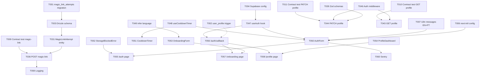

# Tasks: Shaliah Unified Onboarding & Authentication

**Branch**: `004-shaliah-onboarding-n`  
**Input**: Design documents from `/home/patrickkmatias/repos/yesod-ecosystem/specs/004-shaliah-onboarding-n/`  
**Prerequisites**: plan.md ✓, research.md ✓, data-model.md ✓, contracts/ ✓, quickstart.md ✓

## Execution Flow (main)
```
1. Load plan.md from feature directory ✓
   → Tech stack: TypeScript 5.x, Next.js 14+, Supabase, next-intl, shadcn/ui
   → Structure: Web project (apps/shaliah-next + apps/yesod-api)
2. Load optional design documents ✓
   → data-model.md: 3 entities (auth.users, user_profiles, magic_link_attempts)
   → contracts/: 3 endpoints (magic-link-request, user-profile-get, user-profile-update)
   → research.md: 10 technical decisions
   → quickstart.md: 10 acceptance scenarios
3. Generate tasks by category ✓
4. Apply task rules ✓
5. Number tasks sequentially (T001-T076b) ✓
6. Generate dependency graph ✓
7. Create parallel execution examples ✓
8. Validate task completeness ✓
```

## Format: `[ID] [P?] Description`
- **[P]**: Can run in parallel (different files, no dependencies)
- Include exact file paths in descriptions

## Path Conventions
- **Frontend**: `apps/shaliah-next/src/`
- **Backend API**: `apps/yesod-api/src/`
- **Frontend Tests**: `apps/shaliah-next/__tests__/` (Jest + React Testing Library)
- **Backend Tests**: `apps/yesod-api/__tests__/` (Vitest)
- **Shared Logger**: `packages/logger/`
- **i18n Messages**: `apps/shaliah-next/messages/`

---

## Phase 3.1: Setup & Infrastructure

### Database & Migrations
- [x] **T001** [P] Create migration: `magic_link_attempts` table  
  **Path**: `apps/yesod-api/drizzle/0005_create_magic_link_attempts.sql`  
  **Description**: Create table with fields: id (serial), email (text), attempted_at (timestamp), ip_address (inet), success (boolean). Add index on (email, attempted_at DESC).  
  **Reference**: data-model.md § 3

- [x] **T002** [P] Create migration: Update `handle_new_user()` trigger  
  **Path**: `apps/yesod-api/drizzle/0002_update_user_profile_trigger.sql` (rename from 0006 to preserve order)  
  **Description**: DROP TRIGGER IF EXISTS on_auth_user_created; DROP FUNCTION IF EXISTS handle_new_user(); then recreate function to infer language from `raw_app_meta_data->>'inferred_language'` or default to 'pt-BR'. Recreate trigger for auto-creation of user_profiles on auth.users INSERT.  
  **Reference**: data-model.md § 2

- [x] **T003** [P] Add Drizzle schema for `magic_link_attempts`  
  **Path**: `apps/yesod-api/src/db/schema/magic-link-attempts.ts`  
  **Description**: Define Drizzle schema matching migration. Export table definition.  
  **Reference**: data-model.md § 3

### Configuration & Environment
- [x] **T004** [P] Create config/env.ts with validated environment variables  
  **Path**: `apps/yesod-api/src/config/env.ts`  
  **Description**: Create centralized configuration module using Zod for validation. Define schema for: DATABASE_URL, SUPABASE_URL, SUPABASE_ANON_KEY, SUPABASE_SERVICE_ROLE_KEY, JWT_SECRET, PORT, NODE_ENV. Export validated `env` object. Never use `process.env` directly in application code.  
  **Reference**: Constitution v2.5.1 § Configuration Management

- [x] **T004a** [P] Define auth context constants  
  **Path**: `apps/yesod-api/src/contexts/auth/constants.ts`  
  **Description**: Create constants file for auth domain: `MAGIC_LINK_COOLDOWN_SECONDS = 60`, `MAGIC_LINK_HOURLY_LIMIT = 10`, `MAGIC_LINK_EXPIRY_SECONDS = 900` (15 min), `RATE_LIMIT_WINDOW_HOURS = 1`. Export as const object. Single source of truth for all rate limit values.  
  **Reference**: Constitution v2.5.1 § Configuration Management, spec.md FR-004

- [x] **T005** [P] Configure Supabase Auth settings (Programmatic)  
  **Path**: Execute from repo root + document in `docs/shaliah-auth-config.md`  
  **Description**: Use Supabase CLI or SQL to configure: Enable magic link (15min expiry), configure Google OAuth provider, set JWT expiry (access token 1h, refresh token 7d idle + 30d absolute). Commands:
  ```bash
  # Update auth config via SQL (run in Supabase SQL editor or CLI)
  UPDATE auth.config SET 
    enable_signup = true,
    external_email_enabled = true,
    mailer_autoconfirm = false,
    email_link_expiry_time = 900; -- 15 minutes
  
  # Google OAuth: Configure via Supabase Dashboard > Authentication > Providers > Google
  # (Cannot be done via CLI yet - document client ID, secret, redirect URI)
  # Redirect URI: https://[project-ref].supabase.co/auth/v1/callback
  
  # JWT settings: Dashboard > Settings > API > JWT Settings
  # Access token: 3600s (1h), Refresh token: 604800s (7d)
  ```
  Document manual OAuth setup steps. Automate where possible.  
  **Reference**: research.md § 1, § 6

- [x] **T006** [P] Set up next-intl configuration  
  **Path**: `apps/shaliah-next/src/i18n/request.ts` + `apps/shaliah-next/src/middleware.ts`  
  **Description**: Configure next-intl middleware to detect locale from Accept-Language header. Set default to 'pt-BR'. Create locale cookie management. Document middleware execution order: i18n → auth → routes.  
  **Reference**: research.md § 3, § 9

- [x] **T007** [P] Create i18n message files (EN + PT-BR)  
  **Paths**: `apps/shaliah-next/messages/en.json`, `apps/shaliah-next/messages/pt-BR.json`  
  **Description**: **BOTH files must be created.** Define message keys for auth flow, onboarding, profile dashboard. Include: `auth.continueWith`, `auth.continueWithEmail`, `auth.continueWithGoogle`, `auth.magicLinkSent`, `auth.cooldownTimer`, `auth.cooldownMessage`, `auth.linkExpired`, `auth.linkInvalid`, `auth.linkUsed`, `onboarding.enterFullName`, `profile.changeLanguage`, error messages. EN and PT-BR must have identical key structures (values translated).  
  **Reference**: research.md § 9

- [x] **T008** [P] Create Supabase Storage bucket for avatars  
  **Path**: Supabase Dashboard > Storage + document in `docs/shaliah-auth-config.md`  
  **Description**: Create `user-avatars` bucket. Configure RLS policies: Users can INSERT/UPDATE/SELECT their own avatars only (WHERE auth.uid()::text = (storage.foldername(name))[1]). Set bucket settings: 5MB file size limit, allowed MIME types: image/jpeg, image/png, image/webp. Public read access for authenticated users.  
  **Reference**: spec.md FR-010b, NFR-006

- [ ] **T008a** ~~[P] Initialize Sentry for shaliah-next~~ **SKIP** - Already initialized during bootstrapping  
  **Status**: COMPLETE (pre-existing)  
  **Reference**: Constitution § Observability

---

## Phase 3.1.5: DDD Bounded Contexts Setup

**CRITICAL: Must complete before Phase 3.2 (Tests First)**

### Auth Context Structure
- [x] **T008a** [P] Create Auth bounded context structure  
  **Paths**: Create directory structure:  
  ```
  apps/yesod-api/src/contexts/auth/
  ├── domain/          # Business entities, value objects, domain services
  ├── application/    # Use cases, application services
  ├── infra/          # Repositories, external services, rate limiting
  └── api/            # Hono routes, controllers, DTOs
  ```
  **Description**: Create folder structure for Auth bounded context following DDD layering. Add empty `index.ts` in each layer directory.  
  **Reference**: Constitution v2.5.1 Principle I, § Application-Specific Architecture Patterns

- [x] **T008b** [P] Create Auth context Hono sub-app  
  **Path**: `apps/yesod-api/src/contexts/auth/api/routes.ts`  
  **Description**: Create Hono sub-app for Auth context:  
  ```typescript
  import { Hono } from 'hono';
  import type { Variables } from '../../../types';
  
  const authApp = new Hono<{ Variables: Variables }>();
  
  // Routes will be added by implementation tasks
  // authApp.post('/magic-link/request', ...)
  
  export { authApp };
  ```
  Wire into main `server.ts`: `app.route('/api/auth', authApp)`.  
  **Reference**: Constitution v2.5.1 § Bounded Contexts

### Users Context Structure
- [x] **T008c** [P] Create Users bounded context structure  
  **Paths**: Create directory structure:  
  ```
  apps/yesod-api/src/contexts/users/
  ├── domain/          # UserProfile entity, validation rules
  ├── application/    # Profile use cases
  ├── infra/          # Supabase repository
  └── api/            # Profile endpoints
  ```
  **Description**: Create folder structure for Users bounded context. Add empty `index.ts` in each layer directory.  
  **Reference**: Constitution v2.5.1 Principle I

- [x] **T008d** [P] Create Users context Hono sub-app  
  **Path**: `apps/yesod-api/src/contexts/users/api/routes.ts`  
  **Description**: Create Hono sub-app for Users context:  
  ```typescript
  import { Hono } from 'hono';
  import type { Variables } from '../../../types';
  
  const usersApp = new Hono<{ Variables: Variables }>();
  
  // Routes will be added by implementation tasks
  // usersApp.get('/profile', ...)
  // usersApp.patch('/profile', ...)
  
  export { usersApp };
  ```
  Wire into main `server.ts`: `app.route('/api/user', usersApp)`.  
  **Reference**: Constitution v2.5.1 § Bounded Contexts

---

## Phase 3.2: Tests First (TDD) ⚠️ MUST COMPLETE BEFORE 3.3

**CRITICAL: These tests MUST be written and MUST FAIL before ANY implementation**

### Contract Tests (Backend API)
- [x] **T009** [P] Contract test: POST /api/auth/magic-link/request  
  **Path**: `apps/yesod-api/__tests__/contract/magic-link-request.test.ts`  
  **Description**: Test success (200), cooldown (429), hourly limit (429), invalid email (400). Assert response schemas match contract. Use Vitest + supertest.  
  **Reference**: contracts/magic-link-request.md

- [x] **T010** [P] Contract test: GET /api/user/profile  
  **Path**: `apps/yesod-api/__tests__/contract/user-profile-get.test.ts`  
  **Description**: Test authenticated success (200), unauthorized (401), profile fields. Mock Supabase auth. Use Vitest + supertest.  
  **Reference**: contracts/user-profile-get.md

- [x] **T011** [P] Contract test: PATCH /api/user/profile  
  **Path**: `apps/yesod-api/__tests__/contract/user-profile-update.test.ts`  
  **Description**: Test full_name update (200), language update (200), validation errors (400), unauthorized (401). Assert profile returned. Use Vitest + supertest.  
  **Reference**: contracts/user-profile-update.md

### Component Tests (Frontend UI)
- [x] **T012** [P] Component test: AuthForm (email + Google)  
  **Path**: `apps/shaliah-next/__tests__/components/AuthForm.test.tsx`  
  **Description**: Test rendering of "Continue with Email" and "Continue with Google" buttons, email input validation, form submission. Use Jest + RTL.  
  **Reference**: spec.md FR-001

- [x] **T013** [P] Component test: CooldownTimer  
  **Path**: `apps/shaliah-next/__tests__/components/CooldownTimer.test.tsx`  
  **Description**: Test countdown display (60s → 0s), button disabled during cooldown, button enabled at 0s. Mock timers. Use Jest + RTL.  
  **Reference**: spec.md FR-004

- [x] **T014** [P] Component test: OnboardingForm  
  **Path**: `apps/shaliah-next/__tests__/components/OnboardingForm.test.tsx`  
  **Description**: Test full_name input (required), avatar upload (optional), language dropdown (pre-filled), form submission. Use Jest + RTL.  
  **Reference**: spec.md FR-010, FR-010a

- [x] **T015** [P] Component test: ProfileDashboard  
  **Path**: `apps/shaliah-next/__tests__/components/ProfileDashboard.test.tsx`  
  **Description**: Test display of user info (name, avatar, language), language change dropdown, save action. Use Jest + RTL.  
  **Reference**: spec.md FR-011

- [x] **T016** [P] Component test: StorageBlockedError  
  **Path**: `apps/shaliah-next/__tests__/components/StorageBlockedError.test.tsx`  
  **Description**: Test non-dismissible overlay rendering, instructions text, retry button. Use Jest + RTL.  
  **Reference**: spec.md FR-013

### Unit Tests (Domain & Application Layer - TDD Critical)
- [x] **T017** [P] Unit test: MagicLinkAttempt domain entity  
  **Path**: `apps/yesod-api/__tests__/unit/auth/magic-link-attempt.test.ts`  
  **Description**: Test MagicLinkAttempt entity creation, validation, factory methods. Test EmailAddress value object validation (valid/invalid formats). Use Vitest.  
  **Reference**: T025 (entity implementation)

- [x] **T018** [P] Unit test: RateLimitPolicy domain service  
  **Path**: `apps/yesod-api/__tests__/unit/auth/rate-limit-policy.test.ts`  
  **Description**: Test business logic: cooldown calculation (< 60s), hourly limit logic (≥10 attempts), edge cases (expired rows, timezone). Mock attempt data. Use Vitest.  
  **Reference**: T026 (service implementation)

- [x] **T019** [P] Unit test: UserProfile domain entity  
  **Path**: `apps/yesod-api/__tests__/unit/users/user-profile.test.ts`  
  **Description**: Test UserProfile entity methods: updateFullName(), updateLanguage(), isOnboardingComplete(). Test validation rules (2-100 chars). Use Vitest.  
  **Reference**: T032 (entity implementation)

- [x] **T020** [P] Unit test: Profile validation schemas  
  **Path**: `apps/yesod-api/__tests__/unit/users/profile-validation.test.ts`  
  **Description**: Test Zod schemas for user profile (valid/invalid fullName, avatarUrl, language enum). Test edge cases: empty strings, XSS, Unicode. Use Vitest.  
  **Reference**: T033 (validation implementation)

### Integration Tests (End-to-End Scenarios)
- [x] **T021** [P] Integration test: Magic link happy path (Scenario 1)  
  **Path**: `apps/shaliah-next/__tests__/integration/auth-magic-link.test.tsx`  
  **Description**: Test full flow: request magic link → UI state (email shown, cooldown timer) → mock link click → auth success → redirect logic (onboarding vs dashboard). Use Jest + RTL + MSW.  
  **Reference**: quickstart.md Scenario 1

- [x] **T022** [P] Integration test: Cooldown enforcement (Scenario 2)  
  **Path**: `apps/shaliah-next/__tests__/integration/auth-cooldown.test.tsx`  
  **Description**: Test cooldown timer countdown, resend button disabled/enabled cycle. Use Jest + RTL + mock timers.  
  **Reference**: quickstart.md Scenario 2

- [x] **T023** [P] Integration test: Rate limit (Scenario 3)  
  **Path**: `apps/yesod-api/__tests__/integration/rate-limit.test.ts`  
  **Description**: Test 10 sends succeed, 11th fails with 429. Verify different email bypasses limit. Use Vitest + supertest + time mocking for efficiency.  
  **Reference**: quickstart.md Scenario 3

- [x] **T024** [P] Integration test: Google OAuth signup (Scenario 4)  
  **Path**: `apps/shaliah-next/__tests__/integration/auth-google-signup.test.tsx`  
  **Description**: Test Google OAuth flow (mock), account creation, profile pre-fill, onboarding skip. Use Jest + RTL + MSW.  
  **Reference**: quickstart.md Scenario 4

- [x] **T025** [P] Integration test: Google OAuth account linking (Scenario 5)  
  **Path**: `apps/shaliah-next/__tests__/integration/auth-google-linking.test.tsx`  
  **Description**: Test existing magic-link account + Google OAuth with same email → no duplicate, identity linked. Use Jest + RTL + MSW.  
  **Reference**: quickstart.md Scenario 5

- [x] **T026** [P] Integration test: Different Google email creates distinct account (FR-008)  
  **Path**: `apps/shaliah-next/__tests__/integration/auth-google-separate-account.test.tsx`  
  **Description**: Test existing account for emailA@example.com. Authenticate via Google with emailB@example.com → new account created (distinct user_profiles row), no linking. Assert two separate accounts exist. Use Jest + RTL + MSW.  
  **Reference**: spec.md FR-008

- [x] **T027** [P] Integration test: Conditional onboarding (Scenario 7)  
  **Path**: `apps/shaliah-next/__tests__/integration/onboarding-conditional.test.tsx`  
  **Description**: Test onboarding shown when full_name missing, skipped when present. Use Jest + RTL.  
  **Reference**: quickstart.md Scenario 7

- [x] **T028** [P] Integration test: Language change (Scenario 7)  
  **Path**: `apps/shaliah-next/__tests__/integration/profile-language-change.test.tsx`  
  **Description**: Test language dropdown change, profile update, locale cookie set, UI re-renders in new language. Use Jest + RTL.  
  **Reference**: quickstart.md Scenario 7

- [x] **T029** [P] Integration test: Session expiry (Scenario 10)  
  **Path**: `apps/shaliah-next/__tests__/integration/session-expiry.test.tsx`  
  **Description**: Test expired session detection (mock Supabase token verification with expired JWT), redirect to `/auth` page with `?expired=true` query param. Assert error message shown. Use Jest + RTL + MSW.  
  **Acceptance Criteria**: 1) Session expires after 30d absolute or 7d idle (mocked). 2) User redirected to `/auth?expired=true`. 3) Expired session error message displayed to user.  
  **Reference**: quickstart.md Scenario 10

- [x] **T030** [P] Integration test: Storage blocked error (Scenario 9)  
  **Path**: `apps/shaliah-next/__tests__/integration/storage-blocked.test.tsx`  
  **Description**: Test localStorage.setItem() failure → error overlay shown. Use Jest + RTL.  
  **Reference**: quickstart.md Scenario 9

---

## Phase 3.3: Core Implementation (ONLY after tests are failing)

### Backend: Auth Context - Domain Layer
- [ ] **T031** [P] Create MagicLinkAttempt domain entity  
  **Path**: `apps/yesod-api/src/contexts/auth/domain/entities/magic-link-attempt.ts`  
  **Description**: Define MagicLinkAttempt entity with fields: id, email, attemptedAt, ipAddress, success. Include factory method `create()` and value object EmailAddress with validation.  
  **Reference**: data-model.md § 3, Constitution v2.5.1 Principle I

- [ ] **T032** [P] Create RateLimitPolicy domain service  
  **Path**: `apps/yesod-api/src/contexts/auth/domain/services/rate-limit-policy.ts`  
  **Description**: Implement domain service with pure business logic:
  - `canSendMagicLink(attempts: MagicLinkAttempt[]): { allowed: boolean, retryAfterSeconds?: number }`
  - Check cooldown: last attempt < 60s ago
  - Check hourly limit: ≥10 attempts in last hour
  Import constants from `../constants.ts`.  
  **Reference**: spec.md FR-004, Constitution v2.5.1 § DDD layering

### Backend: Auth Context - Infrastructure Layer
- [ ] **T033** Create MagicLinkAttemptRepository (Infrastructure)  
  **Path**: `apps/yesod-api/src/contexts/auth/infra/repositories/magic-link-attempt.repository.ts`  
  **Description**: Implement repository with methods:
  - `create(attempt: MagicLinkAttempt): Promise<void>` - Insert to DB
  - `findRecentByEmail(email: string, windowHours: number): Promise<MagicLinkAttempt[]>`
  Use Drizzle ORM, log via packages/logger.  
  **Reference**: data-model.md § 3, Constitution v2.5.1 § DDD infrastructure layer

- [ ] **T034** Create SupabaseAuthService (Infrastructure)  
  **Path**: `apps/yesod-api/src/contexts/auth/infra/services/supabase-auth.service.ts`  
  **Description**: Wrapper for Supabase Auth SDK:
  - `sendMagicLink(email: string): Promise<void>` - Calls `supabase.auth.signInWithOtp()`
  - Handle Supabase errors, log events via packages/logger  
  **Reference**: Constitution v2.5.1 § DDD infrastructure layer

### Backend: Auth Context - Application Layer
- [ ] **T035** Create SendMagicLinkUseCase (Application Service)  
  **Path**: `apps/yesod-api/src/contexts/auth/application/use-cases/send-magic-link.use-case.ts`  
  **Description**: Orchestrate the magic link flow:
  1. Validate email (use Zod schema)
  2. Load recent attempts via repository
  3. Check rate limits via RateLimitPolicy
  4. If allowed: send magic link via SupabaseAuthService
  5. Record attempt via repository
  6. Return result DTO
  **Depends on**: T031, T032, T033, T034  
  **Reference**: Constitution v2.5.1 § DDD application layer

### Backend: Auth Context - API Layer
- [ ] **T036** POST /api/auth/magic-link/request route handler  
  **Path**: `apps/yesod-api/src/contexts/auth/api/handlers/magic-link-request.handler.ts`  
  **Description**: Hono route handler:
  - Parse request body
  - Call SendMagicLinkUseCase
  - Map use case result to HTTP response (200 or 429)
  - Return JSON per contract  
  **Depends on**: T035  
  **Reference**: contracts/magic-link-request.md

- [ ] **T037** Wire magic-link route to Auth sub-app  
  **Path**: `apps/yesod-api/src/contexts/auth/api/routes.ts` (update T008b)  
  **Description**: Import handler from T036, add to authApp:
  ```typescript
  import { magicLinkRequestHandler } from './handlers/magic-link-request.handler';
  authApp.post('/magic-link/request', magicLinkRequestHandler);
  ```  
  **Depends on**: T036

### Backend: Users Context - Domain Layer
- [ ] **T038** [P] Create UserProfile domain entity  
  **Path**: `apps/yesod-api/src/contexts/users/domain/entities/user-profile.ts`  
  **Description**: Define UserProfile entity with:
  - Fields: id, fullName, avatarUrl, language, telegramUserId, activeSpaceId
  - Methods: `updateFullName()`, `updateLanguage()`, `isOnboardingComplete()`
  - Validation rules (2-100 chars for fullName)  
  **Reference**: data-model.md § 2

- [ ] **T039** [P] Create validation schemas in domain  
  **Path**: `apps/yesod-api/src/contexts/users/domain/validation/profile-validation.ts`  
  **Description**: Define Zod schemas for:
  - `fullNameSchema` (2-100 chars, trimmed)
  - `languageSchema` (enum: en-US, pt-BR, es, fr, de, uk, ru)
  - `avatarUrlSchema` (valid URL, optional)
  Export validation functions.  
  **Reference**: data-model.md § 2, Constitution v2.5.1 § DDD domain layer

### Backend: Users Context - Infrastructure Layer
- [ ] **T040** Create UserProfileRepository (Infrastructure)  
  **Path**: `apps/yesod-api/src/contexts/users/infra/repositories/user-profile.repository.ts`  
  **Description**: Implement repository with methods:
  - `findById(id: string): Promise<UserProfile | null>`
  - `update(profile: UserProfile): Promise<UserProfile>`
  Use Drizzle ORM with user_profiles table, enforce RLS context.  
  **Reference**: data-model.md § 2

### Backend: Users Context - Application Layer
- [ ] **T041** Create GetUserProfileUseCase  
  **Path**: `apps/yesod-api/src/contexts/users/application/use-cases/get-user-profile.use-case.ts`  
  **Description**: Use case to fetch user profile:
  - Input: userId (from auth context)
  - Load profile via repository
  - Return profile DTO or throw NotFoundError  
  **Depends on**: T038, T040

- [ ] **T042** Create UpdateUserProfileUseCase  
  **Path**: `apps/yesod-api/src/contexts/users/application/use-cases/update-user-profile.use-case.ts`  
  **Description**: Use case to update profile:
  - Input: userId, update fields (fullName, avatarUrl, language)
  - Validate via domain validation schemas
  - Load existing profile, apply updates
  - Save via repository
  - Return updated profile DTO  
  **Depends on**: T038, T039, T040

### Backend: Users Context - API Layer
- [ ] **T043** GET /api/user/profile route handler  
  **Path**: `apps/yesod-api/src/contexts/users/api/handlers/get-profile.handler.ts`  
  **Description**: Hono route handler:
  - Extract userId from context (via auth middleware)
  - Call GetUserProfileUseCase
  - Map to HTTP response (200 or 404)  
  **Depends on**: T041  
  **Reference**: contracts/user-profile-get.md

- [ ] **T044** PATCH /api/user/profile route handler  
  **Path**: `apps/yesod-api/src/contexts/users/api/handlers/update-profile.handler.ts`  
  **Description**: Hono route handler:
  - Extract userId from context
  - Parse and validate request body
  - Call UpdateUserProfileUseCase
  - Set locale cookie if language changed
  - Map to HTTP response (200 or 400/401)  
  **Depends on**: T042  
  **Reference**: contracts/user-profile-update.md

- [ ] **T045** Wire profile routes to Users sub-app  
  **Path**: `apps/yesod-api/src/contexts/users/api/routes.ts` (update T008d)  
  **Description**: Import handlers, add to usersApp:
  ```typescript
  import { getProfileHandler } from './handlers/get-profile.handler';
  import { updateProfileHandler } from './handlers/update-profile.handler';
  usersApp.get('/profile', authMiddleware, getProfileHandler);
  usersApp.patch('/profile', authMiddleware, updateProfileHandler);
  ```  
  **Depends on**: T043, T044, T046

### Backend: Shared Middleware
- [ ] **T046** Auth middleware for protected routes  
  **Path**: `apps/yesod-api/src/middleware/auth.ts`  
  **Description**: Implement Hono middleware compliant with Constitution v2.5.1 and Hono.js best practices:
  - Verify Supabase JWT from Authorization header
  - Extract user ID from token payload
  - Attach user to context.variables: `c.set('userId', userId)`
  - Return 401 if token invalid/missing
  - Use Hono's context typing for type safety
  - Handle edge cases: expired token, malformed header
  **Reference**: Constitution v2.5.1 § Architecture Patterns, [Hono middleware docs](https://hono.dev/guides/middleware)

### Frontend: Shared Hooks & Utils
- [ ] **T047** [P] Create `useAuth` hook  
  **Path**: `apps/shaliah-next/src/hooks/useAuth.ts`  
  **Description**: Wrap Supabase auth methods (signInWithOtp, signInWithOAuth, signOut, getUser). Manage auth state. Detect storage blocked errors by testing `localStorage.setItem('test', '1')` in try/catch.  
  **Reference**: research.md § 1, § 8, spec.md FR-013

- [ ] **T048** [P] Create `useCooldownTimer` hook  
  **Path**: `apps/shaliah-next/src/hooks/useCooldownTimer.ts`  
  **Description**: Manage cooldown state (localStorage persistence), countdown timer (useEffect + setInterval), return { secondsRemaining, canResend }. Use `MAGIC_LINK_COOLDOWN_SECONDS` constant.  
  **Reference**: research.md § 2, spec.md FR-004

- [ ] **T049** [P] Create language inference utility  
  **Path**: `apps/shaliah-next/src/lib/infer-language.ts`  
  **Description**: Read Accept-Language header (server-side), parse top preference, fallback to 'pt-BR'. Export inferLanguage(headers) function.  
  **Reference**: research.md § 3

### Frontend: Auth Components
- [ ] **T050** Build `AuthForm` component  
  **Path**: `apps/shaliah-next/src/components/AuthForm.tsx`  
  **Description**: Render "Continue with Email" and "Continue with Google" buttons (shadcn/ui Button). Email flow: show input → send magic link → transition to confirmation state with email, cooldown timer, back button. Use useAuth hook. i18n with next-intl.  
  **Reference**: spec.md FR-001, FR-005  
  **Depends on**: T047, T048

- [ ] **T051** [P] Build `CooldownTimer` component  
  **Path**: `apps/shaliah-next/src/components/CooldownTimer.tsx`  
  **Description**: Display countdown (MM:SS format), disable resend button until 0s. Use useCooldownTimer hook. i18n for labels.  
  **Reference**: spec.md FR-004  
  **Depends on**: T048

- [ ] **T052** [P] Build `StorageBlockedError` component  
  **Path**: `apps/shaliah-next/src/components/StorageBlockedError.tsx`  
  **Description**: Non-dismissible full-screen overlay (Dialog from shadcn/ui). Show error message + instructions. Retry button re-checks storage. i18n.  
  **Reference**: spec.md FR-013

### Frontend: Onboarding & Profile Components
- [ ] **T053** Build `OnboardingForm` component  
  **Path**: `apps/shaliah-next/src/components/OnboardingForm.tsx`  
  **Description**: Form with full_name input (required), avatar upload (optional, Supabase Storage), language dropdown (pre-filled). Submit → PATCH /api/user/profile → redirect to dashboard. Use shadcn/ui Form, Input, Select. i18n.  
  **Reference**: spec.md FR-010, FR-010a  
  **Depends on**: T047, T049

- [ ] **T054** Build `ProfileDashboard` component  
  **Path**: `apps/shaliah-next/src/components/ProfileDashboard.tsx`  
  **Description**: Display user info (name, avatar with placeholder, language). Language change dropdown → PATCH /api/user/profile → update locale cookie. Logout button (app-local). Use shadcn/ui. i18n.  
  **Reference**: spec.md FR-011, FR-012  
  **Depends on**: T047

### Frontend: Page Routes & Auth Callbacks
- [ ] **T055** Create `/auth` page  
  **Path**: `apps/shaliah-next/src/app/auth/page.tsx`  
  **Description**: Render AuthForm component. Detect storage blocked → show StorageBlockedError. Server-side: infer language, set locale cookie.  
  **Depends on**: T050, T052

- [ ] **T055a** Handle magic link errors in `/auth/callback`  
  **Path**: `apps/shaliah-next/src/app/auth/callback/page.tsx` (extends T056)  
  **Description**: Catch and handle magic link errors: expired link, reused link, invalid token. Show user-friendly error page with "Request new link" button (respects cooldown). Use next-intl for error messages (`auth.linkExpired`, `auth.linkInvalid`, `auth.linkUsed`). Display retry-after countdown if within cooldown.  
  **Reference**: spec.md FR-014  
  **Depends on**: T056

- [ ] **T056** Create `/auth/callback` page  
  **Path**: `apps/shaliah-next/src/app/auth/callback/page.tsx`  
  **Description**: Handle Supabase auth callback (magic link click, OAuth redirect). Exchange code for session. Fetch user_profiles. Redirect logic: if full_name NULL → /onboarding, else → /profile. Error handling for expired/reused links (see T055a).  
  **Reference**: research.md § 4  
  **Depends on**: T047

- [ ] **T057** Create `/onboarding` page  
  **Path**: `apps/shaliah-next/src/app/onboarding/page.tsx`  
  **Description**: Protected route (require auth). Render OnboardingForm component. On submit success → redirect to /profile.  
  **Depends on**: T053, T056

- [ ] **T058** Create `/profile` page  
  **Path**: `apps/shaliah-next/src/app/profile/page.tsx`  
  **Description**: Protected route (require auth). Render ProfileDashboard component. Fetch user profile on mount (GET /api/user/profile).  
  **Depends on**: T054, T056

---


## Phase 3.4: Integration & Observability

- [ ] **T059** Wire structured logging for auth events  
  **Path**: `apps/yesod-api/src/routes/auth/magic-link-request.ts` (update T036)  
  **Description**: Log events using packages/logger: `auth.magic_link.sent`, `auth.magic_link.rate_limited`, `auth.magic_link.consumed`. Include email (hashed?), timestamp, IP.  
  **Reference**: spec.md FR-015, research.md § 10

- [ ] **T060** Wire Sentry error tracking in auth flow  
  **Path**: `apps/shaliah-next/src/components/AuthForm.tsx` (update T050)  
  **Description**: Capture auth errors to Sentry (magic link send failure, OAuth errors). Add user context.  
  **Reference**: Constitution § Observability

- [ ] **T061** Add RLS policies for `user_profiles`  
  **Path**: Supabase Dashboard (manual) + document in `docs/shaliah-auth-config.md`  
  **Description**: Enable RLS on user_profiles. Policy: SELECT/UPDATE where `auth.uid() = id`. Test with different users.  
  **Reference**: data-model.md § 2

- [ ] **T062** Test cross-app session behavior  
  **Path**: Manual test (document in `docs/cross-app-session-test.md`)  
  **Description**: Deploy to staging. Verify session shared across shaliah-next tabs. Verify logout is app-local (future: test with Ezer web UI).  
  **Reference**: research.md § 5

### Security & Compliance
- [ ] **T062a** [P] Implement OAuth failure logging  
  **Path**: `apps/shaliah-next/src/components/AuthForm.tsx` (update T050)  
  **Description**: Add structured logging for Google OAuth failures using packages/logger: `auth.oauth.google.failure` (ERROR level) with error_type, message, timestamp. Hash email if available. Wire to Sentry for monitoring.  
  **Reference**: spec.md FR-015 (missing OAuth failure coverage)

- [ ] **T062b** [P] Add soft delete support to user_profiles  
  **Path**: `apps/yesod-api/src/contexts/users/domain/user-profile.entity.ts` (new)  
  **Description**: Create UserProfile domain entity with soft delete support. Add `deleted_at` field (timestamp, nullable). Implement `markDeleted()` method that sets deleted_at to current timestamp. Add `isDeleted()` getter. Reference implementation per Constitution § Data Management.  
  **Reference**: spec.md NFR-001

- [ ] **T062c** [P] Create migration: Add deleted_at to user_profiles  
  **Path**: `apps/yesod-api/drizzle/0007_add_user_profiles_soft_delete.sql`  
  **Description**: ALTER TABLE user_profiles ADD COLUMN deleted_at TIMESTAMP NULL. CREATE INDEX idx_user_profiles_active ON user_profiles(id) WHERE deleted_at IS NULL. Update views/queries to filter deleted_at IS NULL by default.  
  **Reference**: spec.md NFR-001

- [ ] **T062d** [P] Implement IP address nullification job  
  **Path**: `apps/worker/src/handlers/gdpr-cleanup.ts` (new)  
  **Description**: Create scheduled job (pg-boss) to nullify IP addresses in magic_link_attempts table after 24 hours. Query: UPDATE magic_link_attempts SET ip_address = NULL WHERE attempted_at < NOW() - INTERVAL '24 hours' AND ip_address IS NOT NULL. Log cleanup count.  
  **Reference**: spec.md FR-015 (GDPR compliance)

---

## Phase 3.5: i18n & Polish

### i18n Expansion
- [ ] **T063** [P] Add Spanish (es) translations  
  **Path**: `apps/shaliah-next/messages/es.json`  
  **Description**: Copy EN keys, translate to Spanish. Verify with language switcher.  
  **Reference**: Constitution Principle IX

- [ ] **T064** [P] Add French (fr) translations  
  **Path**: `apps/shaliah-next/messages/fr.json`  
  **Description**: Copy EN keys, translate to French.

- [ ] **T065** [P] Add German (de) translations  
  **Path**: `apps/shaliah-next/messages/de.json`  
  **Description**: Copy EN keys, translate to German.

- [ ] **T066** [P] Add Ukrainian (uk) translations  
  **Path**: `apps/shaliah-next/messages/uk.json`  
  **Description**: Copy EN keys, translate to Ukrainian.

- [ ] **T067** [P] Add Russian (ru) translations  
  **Path**: `apps/shaliah-next/messages/ru.json`  
  **Description**: Copy EN keys, translate to Russian.

### Security Testing & Additional Coverage
- [ ] **T068** [P] Integration test: RLS policies for user_profiles  
  **Path**: `apps/yesod-api/__tests__/integration/rls-user-profiles.test.ts`  
  **Description**: Test RLS enforcement: User A cannot SELECT/UPDATE User B's profile. User can SELECT/UPDATE own profile. Anonymous users cannot access any profiles. Use Supabase test client with different auth contexts. Use Vitest.  
  **Reference**: Missing RLS test coverage

- [ ] **T068a** [P] Integration test: Avatar storage RLS policies  
  **Path**: `apps/yesod-api/__tests__/integration/rls-avatar-storage.test.ts`  
  **Description**: Test Supabase Storage RLS: User A cannot upload/access User B's avatar folder. User can upload/access own avatar. Public read for authenticated users. Test file upload, download, deletion scenarios. Use Vitest.  
  **Reference**: spec.md NFR-006

### Unit Tests & Performance
- [ ] **T069** [P] Unit test: RateLimitService  
  **Path**: `apps/yesod-api/__tests__/unit/rate-limit-service.test.ts`  
  **Description**: Test cooldown calculation, hourly limit logic, edge cases (expired rows, timezone). Use Vitest.

- [ ] **T070** [P] Unit test: Input validation schemas  
  **Path**: `apps/yesod-api/__tests__/unit/validation.test.ts`  
  **Description**: Test Zod schemas for user profile (valid/invalid full_name, avatar_url, language). Use Vitest.

- [ ] **T071** Performance test: Auth UI load time  
  **Path**: Manual test (document in `docs/performance-baseline.md`)  
  **Description**: Measure auth page load time on 3G Fast (Chrome DevTools throttling). Target: <2s. Optimize if needed.  
  **Reference**: spec.md NFR-004

- [ ] **T072** Performance test: Magic link send latency  
  **Path**: Manual test (document in `docs/performance-baseline.md`)  
  **Description**: Measure POST /api/auth/magic-link/request latency. Target: <200ms. Profile if needed.

### Accessibility & Documentation
- [ ] **T073** Accessibility audit: Keyboard navigation  
  **Path**: Manual test (document in `docs/accessibility-audit.md`)  
  **Description**: Test all auth, onboarding, profile flows with keyboard only. Verify focus indicators, tab order, ARIA labels. Fix issues.  
  **Reference**: spec.md NFR-002

- [ ] **T074** Accessibility audit: Screen reader  
  **Path**: Manual test (document in `docs/accessibility-audit.md`)  
  **Description**: Test with NVDA/JAWS. Verify form labels, error messages, button descriptions. Fix issues.

- [ ] **T075** Update API documentation  
  **Path**: `docs/yesod-api.md`  
  **Description**: Document 3 new endpoints (magic-link request, profile get/update). Include request/response examples, error codes.

- [ ] **T076** Final quickstart validation  
  **Path**: Execute `specs/004-shaliah-onboarding-n/quickstart.md` scenarios  
  **Description**: Run all 10 manual test scenarios. Check off validation checklist. Document any issues.

- [ ] **T076a** [P] Audit i18n message keys for FR-016 compliance  
  **Path**: `apps/shaliah-next/messages/en.json`, `apps/shaliah-next/messages/pt-BR.json`  
  **Description**: Search for legacy keys: "sign in", "sign up", "login", "register", "signin", "signup". Replace with "Continue with" language per FR-016. Update AuthForm component to use new keys. Ensure consistency across EN and PT-BR.  
  **Reference**: spec.md FR-016  
  **Depends on**: T007

- [ ] **T076b** [P] Document avatar storage specifications  
  **Path**: `docs/avatar-storage-spec.md` or inline in T053  
  **Description**: Document Supabase Storage configuration for avatars: Bucket name `user-avatars`, path `/public/{user_id}/avatar.{ext}`, max file size 5MB, allowed types (image/jpeg, image/png, image/webp). RLS policies: public read (`SELECT`), user-writable (`INSERT`, `UPDATE` where `auth.uid() = user_id`). Default placeholder: shadcn/ui Avatar component with user initials (first 2 chars of full_name) on hashed color background.  
  **Reference**: Analysis M2, M4

---

## Dependencies



### Critical Path
1. Setup (T001-T008a) [can run in parallel]
2. DDD Structure (T008a-T008d) [bounded contexts]
3. Tests (T009-T030) [MUST fail before implementation]
4. Backend implementation (T031-T046)
5. Frontend hooks/utils (T047-T049)
6. UI components (T050-T054)
7. Page routes (T055-T058)
8. Integration & Observability (T059-T062d)
9. Polish & i18n (T063-T076b)

### Parallel Execution Blocks

**Block 1: Setup (parallel)**
```bash
# Can run simultaneously:
Task T001: Create migration magic_link_attempts
Task T002: Create migration user_profile trigger
Task T003: Drizzle schema
Task T004: Supabase config (manual)
Task T005: next-intl config
Task T006: i18n messages EN+PT
Task T007: Sentry init
```

**Block 2: Contract Tests (parallel after setup)**
```bash
# All contract tests can run in parallel:
Task T008: Contract test POST magic-link
Task T009: Contract test GET profile
Task T010: Contract test PATCH profile
```

**Block 3: Component Tests (parallel after setup)**
```bash
# All component tests can run in parallel:
Task T011: Component test AuthForm
Task T012: Component test CooldownTimer
Task T013: Component test OnboardingForm
Task T014: Component test ProfileDashboard
Task T015: Component test StorageBlockedError
```

**Block 4: Integration Tests (parallel after setup)**
```bash
# All integration tests can run in parallel:
Task T016-T024: Integration tests (9 total)
```

**Block 5: Backend Implementation (sequential after tests pass)**
```bash
# Domain layer first, then infrastructure, then API:
Task T031-T040: Backend bounded context implementation
```

**Block 6: Frontend Utils (parallel after setup)**
```bash
# Can run simultaneously:
Task T047: useAuth hook
Task T048: useCooldownTimer hook
Task T049: infer language util
```

**Block 7: Frontend Components (parallel after hooks)**
```bash
# All UI components can run in parallel:
Task T050: AuthForm
Task T051: CooldownTimer  
Task T052: StorageBlockedError
Task T053: OnboardingForm
Task T054: ProfileDashboard
```

**Block 8: i18n Expansion (parallel after EN+PT complete)**
```bash
# All additional languages can run in parallel:
Task T063: Spanish
Task T064: French
Task T065: German
Task T066: Ukrainian
Task T067: Russian
```

---

## Validation Checklist
*GATE: Checked before marking tasks complete*

- [x] All contracts have corresponding tests (T009-T011 for 3 contracts)
- [x] All entities have model/migration tasks (T001-T003)
- [x] All tests come before implementation (Phase 3.2 before 3.3)
- [x] Parallel tasks truly independent (marked [P])
- [x] Each task specifies exact file path
- [x] No task modifies same file as another [P] task
- [x] Supabase usage validated for auth (T005, T047, T050, T056)
- [x] i18n coverage for pt-BR and en (T007); es, fr, de, uk, ru planned (T063-T067)
- [x] Observability wired (T008a Sentry, T059 logging)
- [x] Long-running work: N/A (magic link send is <200ms, not queued)

---

## Notes

- **TDD Enforcement**: Tests (T009-T030) MUST fail before starting implementations (T031-T058).
- **Commit Strategy**: Commit after each task completion for incremental progress.
- **Session Testing**: Cross-app session behavior (T062) requires manual staging test until Ezer web UI exists.
- **Rate Limit Storage**: Currently uses DB table (magic_link_attempts). Future: migrate to Redis/Upstash for better performance.
- **Avatar Placeholder**: Use shadcn/ui Avatar component with initials fallback (e.g., "PS" for "Paulo Santos").
- **Constitution Compliance**: All constitutional principles satisfied (verified in plan.md Constitution Check).

---

**Total Tasks**: 76 + 4 sub-tasks (T008a-T008d, T055a, T062a-T062d, T068a, T076a-T076b) = **82 Total**  
**Estimated Parallel Blocks**: 10  
**Sequential Tasks (Critical Path)**: ~30  
**Completion Target**: All acceptance scenarios (quickstart.md) passing

---

*Based on Constitution v2.5.1 — see `.specify/memory/constitution.md`*
